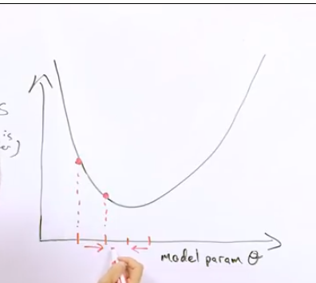

# Welcome 👋

### HERE ARE ALL THE NOTES TAKEN FROM THE GOOGLE MACHINE LEARNING CRASH COURSE THAT YOU CAN FIND [here](https://developers.google.com/machine-learning/crash-course)

The ML changes how you write an algorithm, it changes the common way to write a long code, to just write a simpler code with lots of examples

# [Framing](https://developers.google.com/machine-learning/crash-course/framing/ml-terminology)

Supervised Machine Learning:

-   The ML system learn how to combine an input and produce useful predictions on newer datas
-   We use **labels**, where labels are the variables that we want to predict (represented by _y_)
-   We also use **features**, where features are the variables that describes our data (represented by _x_{x1, x2, x3...})
-   A **model** is examples to predic labels

## Regression vs Classification

-   In regression, the ml model will predict continuous values like (0, 100, 200, 10000, ...)
-   In classification, the ml model will predict concrete data, like (dog, paper, true or false, ...)

# [Descending into ML](https://developers.google.com/machine-learning/crash-course/descending-into-ml/linear-regression)

-   Lots of complex ways to learn from data
-   Training a model, means learning good values for all the weights and the bias from label examples.
-   In supervised learning, the ml algorithm builds a model that attempt to find a model that minimizes the loss. (**Empirical Risk Minimization**)
-   The loss is the penality for bad predictions. That is, **loss** is a number that indicates how bad the model is on a single example.
    -   Perfect prediction: loss = 0
    -   Otherwise: loss > 0
-   The goal here, is to find a set of weights and biases that have the lowest loss (closer to 0).
    

# [Reducing Loss](https://developers.google.com/machine-learning/crash-course/reducing-loss/an-iterative-approach)

-   In order to reduce loss, we use a strategy that is called **Gradient Descent**, with that, we can say to our ml model, witch direction it needs to go, in order to reduce the loss produced by the predictions
    
-   The learning rate represents how much our model will calculate the gradient descent, using a fixed learning rate, our model will recalculate every time ultil it achieves the minimal loss. But, various values has different behaviors, like huge numbers will be going past and before and take long to achieve the minimal, or really small numbers will too, take long to achieve the minimal. See a live example [here](https://developers.google.com/machine-learning/crash-course/fitter/graph)
    
-   A gradient tells us in what direction we need to go to achieve the minimal loss (0).
    -   If it's before the minimal loss, we need to go to x positive way ->
    -   Or, if it's after the minimal loss, we need to go to x negative way <-
-   The learning rate is, in other words, how bigger is the number we will be calculating to reach our minimal loss.
    -   If it's too small, it will take forever to reach te minimun
    -   Or, if it's too larger, we will be passing by the minimal loss forwards and backwards, making our ml model take too long to reach the minimal loss
-   There's a Goldilocks learning rate for every regression problem. The Goldilocks value is related to how flat the loss function is. If you know the gradient of the loss function is small then you can safely try a larger learning rate, which compensates for the small gradient and results in a larger step size. (Taken exactly like in website)
    

## Stochastic Gradient Descent

-   I didn't understanded that so... let's move on.
-   If you wanna learn more about this: [here](https://developers.google.com/machine-learning/crash-course/reducing-loss/stochastic-gradient-descent)
